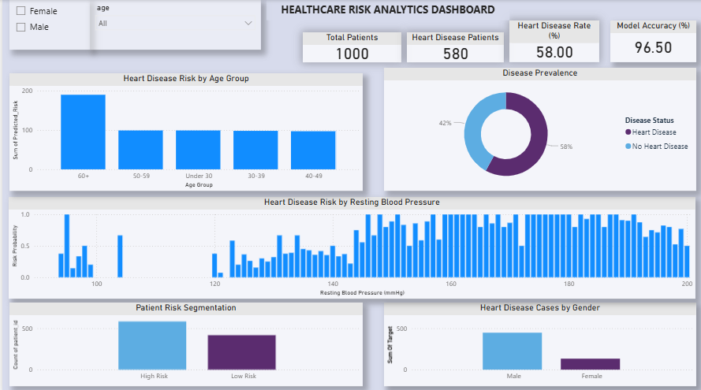

Healthcare Risk Analytics Dashboard | SQL, Python, Machine Learning, Power BI

This project analyzes patient health data to identify heart disease risk factors using machine learning and interactive data visualization.

Project Overview

The goal of this project is to analyze healthcare data and build a predictive analytics workflow to identify patterns related to heart disease risk.

Tools & Technologies

• Python (Google Colab)
• Pandas & NumPy
• Scikit-learn
• Matplotlib & Seaborn
• Power BI

Machine Learning

A Logistic Regression model was used to classify patients based on heart disease risk using various health indicators such as age, blood pressure, cholesterol, and maximum heart rate.

Model evaluation metrics include:

• Accuracy  
• Confusion Matrix  
• Classification Report  

 Dashboard Insights

The Power BI dashboard provides insights such as:

• Heart disease risk by age group  
• Disease prevalence among patients  
• Blood pressure vs heart disease risk  
• Patient risk segmentation  
• Gender based disease distribution  

Key Insights from Data Analysis

• Patients aged 50+ show a significantly higher probability of heart disease.

• Individuals with higher cholesterol levels tend to have increased disease risk.

• Certain chest pain types are strongly associated with positive heart disease diagnosis.

• Blood pressure trends indicate that hypertensive patients fall into higher risk categories.

• Male patients appear to have slightly higher disease occurrence compared to female patients.
 
 Project Architecture

Raw Healthcare Dataset  
        ↓  
Data Extraction & Querying (SQL)  
        ↓  
Data Cleaning & Feature Preparation (Python – Pandas)  
        ↓  
Machine Learning Model (Logistic Regression)  
        ↓  
Model Evaluation (Accuracy, Precision, Recall, F1 Score)  
        ↓  
Business Intelligence Dashboard (Power BI)  
        ↓  
Healthcare Risk Insights & Decision Support
  
  Dashboard Preview

